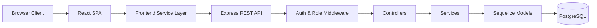

# SYNCTEX

**A multi-tenant office management SaaS workspace built for integration and reliability.**

<p align="center">
  
</p>

<h1 align="center">SYNCTEX</h1>

<p align="center">
  <strong>A SaaS-based multi-tenant office management system for centralizing employee operations, task tracking, enquiries, attendance, courses, branches, and day-to-day organizational workflows.</strong>
</p>

<p align="center">
  
  
  
  
  
</p>

---

## Overview

SYNCTEX is a full-stack SaaS platform built to streamline and centralize organizational operations across employee management, task tracking, enquiries, attendance, courses, branch handling, and core workflow administration — all within a secure multi-tenant architecture.

The system is split into a React + TypeScript frontend and an Express + Sequelize backend backed by PostgreSQL. Tenant context flows through JWT authentication, with most business modules scoping data to an `organizationId` so multiple organizations operate with fully isolated records on a shared platform.

The current implementation includes organization onboarding, role-aware authentication, branch and course management, employee records, department and role masters, enquiries, tasks, attendance sessions, and organization settings. Certain areas — such as module-level access control and parts of the attendance experience — are in active development and exist as structured placeholders for upcoming work.

---

## Features

- **Multi-tenancy** — Workspace isolation centered around `organizationId`-scoped data access
- **Organization Onboarding** — Public signup flow that creates the first admin account and a default `HOME` branch automatically
- **JWT Authentication** — Role-aware sign-in for admins and employees with bearer token session management
- **Employee Directory** — Searchable records with status, department, role, and date-of-joining fields
- **Task Management** — Priority and status-tracked work items scoped to the organization
- **Enquiry Management** — Lead lifecycle tracking with `NEW`, `CONTACTED`, and `CLOSED` states
- **Attendance Workflow** — Punch in/out, break tracking, session summaries, and date-based lookup
- **Course Management** — Code and slug-validated courses with pricing, GST, delivery mode, and archive support
- **Branch Management** — Geolocation-enriched branch records with GST details, ownership, and Maps links
- **Organization Settings** — Founder name, contact information, and tax metadata management
- **Admin Controls** — Admin-only user management for creating and updating organization accounts

---

## Tech Stack

| Layer | Technologies |
|---|---|
| **Frontend** | React 19, TypeScript, Vite, React Router DOM 7, Recharts |
| **Backend** | Node.js, Express 5, Sequelize 6, Sequelize CLI, dotenv, cors |
| **Database** | PostgreSQL, Sequelize models, Sequelize CLI migrations |
| **Auth & Security** | JWT (`jsonwebtoken`), bcrypt password hashing, `authenticate` middleware, `requireAdmin` middleware |
| **Integrations** | Browser Geolocation API (branch location capture), fetch-based frontend service layer |
| **Deployment** | Vercel SPA routing (frontend), production startup scripts with migration support (backend) |

---

## Architecture



- The frontend stores the JWT and organization metadata in `localStorage` and attaches `Authorization: Bearer <token>` on every API request
- `authenticate` middleware verifies the JWT and injects `userId`, `organizationId`, and `role` into `req.user` for all downstream handlers
- Controllers delegate business logic to service modules, which query organization-scoped records through Sequelize
- In development, models are auto-synced via `sequelize.sync({ alter: true })`; in production, the startup script runs migrations before the server starts
- Runtime models live in `backend/src/models`; CLI migration tooling is wired through `backend/.sequelizerc` and `backend/models/index.js`

---

## Project Structure

```
SYNCTEX/
├── backend/
│   ├── config/
│   │   ├── config.json
│   │   └── database.js
│   ├── migrations/
│   │   ├── 20260314185629-create-organizations.js
│   │   ├── 20260314185824-create-users.js
│   │   ├── 20260328165956-create-tasks.js
│   │   ├── 20260328173351-create-enquiries.js
│   │   ├── 20260331190000-create-attendance.js
│   │   ├── 20260331190001-create-branches.js
│   │   ├── 20260402000000-create-courses.js
│   │   ├── 20260403000000-create-employees.js
│   │   ├── 20260403100000-create-departments.js
│   │   ├── 20260403100500-create-roles.js
│   │   ├── 20260404000000-add-founder-name-to-organizations.js
│   │   ├── 20260404100000-add-contact-info-to-organizations.js
│   │   └── 20260405120000-add-tax-info-to-organizations.js
│   ├── models/
│   │   └── index.js
│   ├── scripts/
│   │   ├── check-env.js
│   │   ├── reset-migrations.js
│   │   └── start.js
│   └── src/
│       ├── app.js
│       ├── server.js
│       ├── controllers/
│       ├── middleware/
│       ├── models/
│       ├── routes/
│       └── services/
└── frontend/
    ├── public/
    │   ├── favicon.svg
    │   └── icons.svg
    └── src/
        ├── App.tsx
        ├── main.tsx
        ├── components/
        ├── hooks/
        ├── services/
        └── pages/
            ├── LandingPage.tsx
            ├── LoginPage.tsx
            ├── SignupPage.tsx
            └── Dashboard/
                ├── Dashboard.tsx
                ├── DashboardHome.tsx
                ├── AccessControl.tsx
                ├── Attendance/
                ├── Branches/
                ├── Courses/
                ├── HR/
                ├── Sales/
                ├── Settings/
                ├── Tasks/
                └── Team/
```

---

## Getting Started

### Prerequisites

- Node.js and npm
- PostgreSQL

### 1. Clone the repository

```bash
git clone https://github.com/bhuwangolhar/SYNCTEX.git
cd SYNCTEX
```

### 2. Install dependencies

```bash
# Backend
cd backend && npm install

# Frontend
cd ../frontend && npm install
```

### 3. Configure environment variables

```bash
cp backend/.env.example backend/.env
cp frontend/.env.example frontend/.env
```

See the [Environment Variables](#environment-variables) section for all required fields.

### 4. Start the backend

```bash
# Development (nodemon)
cd backend && npm run start:dev

# Production-style (validates env, runs migrations, starts server)
cd backend && npm start
```

### 5. Start the frontend

```bash
cd frontend && npm run dev
```

Default local URLs:

- Frontend: `http://localhost:5173`
- Backend: `http://localhost:3000`

---

## Environment Variables

### Backend — `backend/.env`

| Variable | Required | Description |
|---|---|---|
| `DATABASE_URL` | Recommended in production | Full PostgreSQL connection string for Sequelize CLI and production runtime |
| `DB_HOST` | Yes (local, if no `DATABASE_URL`) | PostgreSQL host for local development |
| `DB_NAME` | Yes (local, if no `DATABASE_URL`) | PostgreSQL database name for local development |
| `DB_USER` | Yes (local, if no `DATABASE_URL`) | PostgreSQL user for local development |
| `DB_PASSWORD` | Yes (local, if no `DATABASE_URL`) | PostgreSQL password for local development |
| `PORT` | Optional | API server port — defaults to `3000` |
| `NODE_ENV` | **Yes for deployment** | `development` or `production` — controls model sync vs. migrations |
| `JWT_SECRET` | **Yes** | Secret for signing and verifying JWTs |
| `CORS_ORIGINS` | Optional | Comma-separated allowed origins (currently hardcoded in `src/app.js`) |
| `DB_SSL` | Optional | SSL flag — driven by `NODE_ENV` and `DATABASE_URL` in `config/database.js` |

### Frontend — `frontend/.env`

| Variable | Required | Description |
|---|---|---|
| `VITE_API_BASE_URL` | **Yes** | Base URL for all backend API requests — e.g. `http://localhost:3000/api` |

---

## Core Modules

| Module | Summary |
|---|---|
| **Employee Management** | Full CRUD with employee ID, name, email, phone, department, role, status, and date of joining; search and status filtering |
| **Task Management** | Organization-scoped tasks with `TODO` / `IN_PROGRESS` / `DONE` statuses and `LOW` / `MEDIUM` / `HIGH` priority levels |
| **Enquiry Management** | Lead capture and lifecycle tracking through `NEW`, `CONTACTED`, and `CLOSED` states |
| **Attendance Management** | Day and session tracking with punch in/out, break start/end, session summaries, and date-based lookup |
| **Course Management** | Code and slug-validated courses with delivery mode, pricing, GST, language, fee plans, and soft archive support |
| **Branch Management** | Geolocation-enriched branch records with address metadata, GST details, Maps links, and ownership assignment |
| **Multi-Tenancy** | Organizations as tenant boundaries; `organizationId` scopes all records and is enforced at the service layer via `req.user` |
| **Organization Settings** | Founder name, contact details, and tax information stored as structured JSON metadata per tenant |

---

## API Reference

Base path: `/api`

### Public

| Method | Endpoint | Description |
|---|---|---|
| `GET` | `/` | Server status response |
| `GET` | `/api/health` | Health check |
| `POST` | `/api/auth/register` | Create a new organization and its first admin user |
| `POST` | `/api/auth/login` | Sign in an admin or employee, return JWT |

### Protected — all require `Authorization: Bearer <token>`

| Module | Method | Endpoint | Access |
|---|---|---|---|
| **Tasks** | `GET / POST` | `/api/tasks` | Authenticated |
| **Tasks** | `PUT / DELETE` | `/api/tasks/:id` | Authenticated |
| **Enquiries** | `GET / POST` | `/api/enquiries` | Authenticated |
| **Enquiries** | `PUT / DELETE` | `/api/enquiries/:id` | Authenticated |
| **Attendance** | `POST` | `/api/attendance/punch-in` | Authenticated |
| **Attendance** | `POST` | `/api/attendance/punch-out` | Authenticated |
| **Attendance** | `GET` | `/api/attendance/today` | Authenticated |
| **Attendance** | `GET` | `/api/attendance/by-date?date=YYYY-MM-DD` | Authenticated |
| **Attendance** | `POST` | `/api/attendance/break/start` | Authenticated |
| **Attendance** | `POST` | `/api/attendance/break/end` | Authenticated |
| **Attendance** | `PATCH` | `/api/attendance/session/:id/summary` | Authenticated |
| **Branches** | `GET / POST` | `/api/branches` | Authenticated |
| **Branches** | `GET / PUT / DELETE` | `/api/branches/:id` | Authenticated |
| **Employees** | `GET / POST` | `/api/employees` | Authenticated |
| **Employees** | `GET / PUT / DELETE` | `/api/employees/:id` | Authenticated |
| **Courses** | `GET / POST` | `/api/courses` | Authenticated |
| **Courses** | `GET` | `/api/courses/stats` | Authenticated |
| **Courses** | `GET / PUT / DELETE` | `/api/courses/:id` | Authenticated |
| **Courses** | `PATCH` | `/api/courses/:id/archive` | Authenticated |
| **Departments** | `GET / POST` | `/api/departments` | Authenticated |
| **Departments** | `PUT / DELETE` | `/api/departments/:id` | Authenticated |
| **Roles** | `GET / POST` | `/api/roles` | Authenticated |
| **Roles** | `PUT / DELETE` | `/api/roles/:id` | Authenticated |
| **Organizations** | `GET / PUT` | `/api/organizations/:organizationId` | Authenticated |
| **Users** | `GET / POST` | `/api/users` | **Admin only** |
| **Users** | `PUT` | `/api/users/:id` | **Admin only** |

---

## Security & Multi-Tenancy

- **Passwords** hashed with `bcryptjs` before storage — never stored in plain text
- **JWTs** signed with `JWT_SECRET` and carry `userId`, `organizationId`, and `role` in the payload
- **`authenticate` middleware** verifies every protected request and populates `req.user` for downstream handlers
- **`requireAdmin` middleware** gates all user management endpoints to admin-role tokens only
- **Tenant isolation** enforced at the service layer — all module queries filter by `organizationId` from `req.user`
- **Frontend auth helpers** attach bearer tokens consistently across all service modules
- **Organization metadata** (contact info, tax info) stored as JSON fields for flexible per-tenant updates
- **CORS** currently allows `http://localhost:5173` and `https://synctex.vercel.app` — update `backend/src/app.js` when deploying to a custom domain

---

## Usage Guide

1. **Sign up** at `/signup` — the backend automatically creates the first `ADMIN` user and a default `HOME` branch
2. **Sign in** at `/login` — the JWT and org metadata are stored in `localStorage` for all subsequent requests
3. **Add branches** from the Branches module and assign owners
4. **Create departments and roles** from the HR module to structure your employee directory
5. **Add employees** and create login-enabled user accounts as needed
6. **Track tasks** with priorities and statuses from the Tasks module
7. **Manage enquiries** and move leads through the `NEW → CONTACTED → CLOSED` lifecycle
8. **Record attendance** using punch in/out and break tracking from the Attendance module
9. **Set up courses** with pricing, delivery mode, and GST details from the Courses module
10. **Update organization settings** — founder name, contact details, and tax information — from Settings

---

## Deployment

### Frontend (Vercel)

- Build command: `npm run build`
- Output directory: `dist`
- SPA rewrites are pre-configured in `frontend/vercel.json`
- Set `VITE_API_BASE_URL` to the deployed backend API base URL

### Backend

- Set the deployment root to `backend/`
- Install: `npm install`
- Start: `npm start` — validates env, runs migrations, then starts the server
- Required environment variables: `DATABASE_URL`, `JWT_SECRET`, `NODE_ENV=production`, `PORT`
- Update the CORS allowlist in `backend/src/app.js` if your frontend domain changes

> **Note:** Avoid `npm run deploy` for routine restarts — it chains `migrate:reset` before applying migrations and will wipe existing migration history.

### Database

- Provision a PostgreSQL instance and set `DATABASE_URL`
- Production config in `config/database.js` expects SSL for managed PostgreSQL environments

---

## Roadmap

- [ ] Complete the Access Control module with module-level permissions and role-based automation
- [ ] Expand attendance with richer on-site validation and a fully productionized UX
- [ ] Replace placeholder dashboard metrics with live aggregated organization data
- [ ] Add audit logging for critical admin and settings actions
- [ ] Introduce automated test coverage and CI checks across frontend and backend
- [ ] Add integrations for communication, payments, and external operational tooling

---

## Contributing

1. Fork the repository and create a feature branch
2. Keep frontend and backend changes scoped to the module you are updating
3. Add or update Sequelize migrations for any data model changes
4. Verify the frontend and backend locally before opening a pull request
5. Document any notable behavioral or setup changes in this README

---

## License

This project is licensed under the **MIT License**. See the [LICENSE](LICENSE) file for details.

---

*Built by **Bhuvan Golhar***  
➢ **LinkedIn**: https://linkedin.com/in/bhuvangolhar  
➢ **Portfolio**: https://bhuvangolhar.space